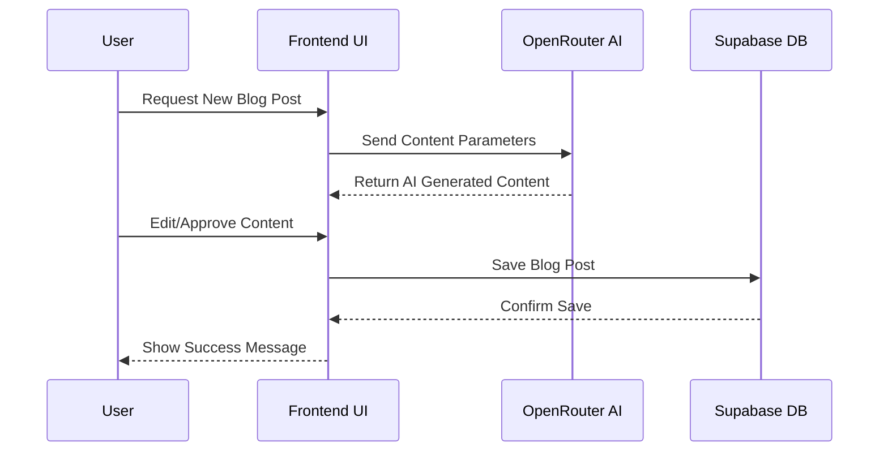
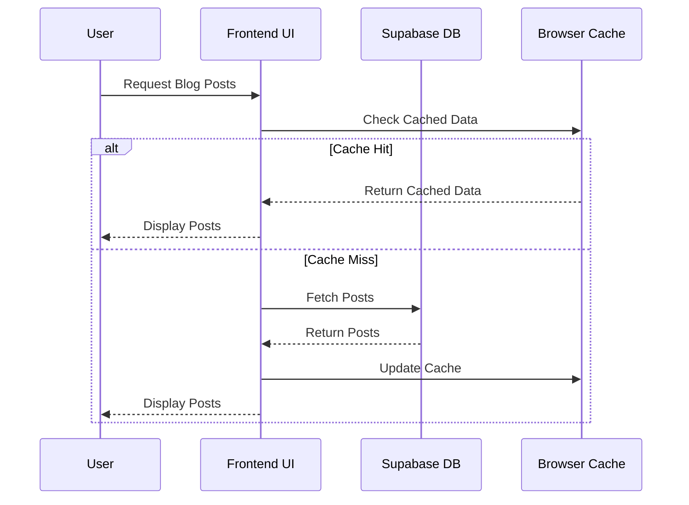

# Application Sequence Diagrams

## User Content Generation Flow

## Content Retrieval Flow

## Data Flow Considerations

1. **Client-Side Processing**
   - All AI processing happens through direct OpenRouter API calls
   - No server-side processing required
   - Content validation and sanitization on client

2. **Data Persistence**
   - Immediate local cache updates
   - Optimistic UI updates
   - Background sync with Supabase

3. **Error Handling**
   - Retry logic for failed API calls
   - Offline support through caching
   - Graceful degradation if AI service unavailable

4. **Security Flow**
   - API keys stored in environment variables
   - Row Level Security in Supabase
   - Content validation before storage

This diagram illustrates the key interactions and data flows in the system, highlighting the stateless nature of the SPA architecture and the integration points between different services.